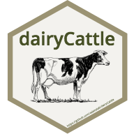

# dairyCattle 
A system for modeling the nutrient requirement of dairy cattle.

## Overview
젖소의 영양 모델 및 기계학습 모델을 위한 패키지입니다.

## Installation

```r
 # The development version from GitHub:
 # install.packages("devtools")
 devtools::install_github("adatalab/dairyCattle")
```

## Usage
### 1. 검정성적 불러오기

```r
 library(dairyCattle)
 read_cattle(file="text.xlsx", na.rm=FALSE)
```

## Notification

개발중인 패키지입니다.

## Getting helps
Email: ruminoreticulum@gmail.com
