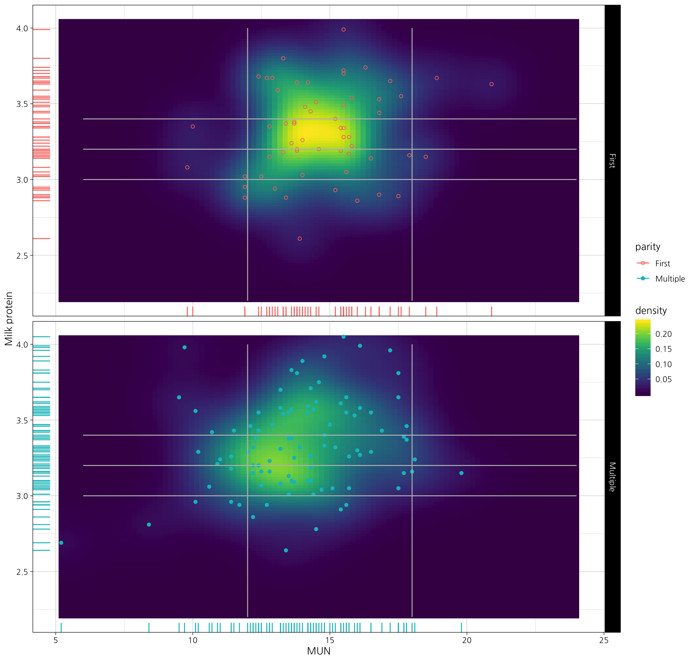

# dairyCattle 
## Overview
A system for modeling the nutrient requirement of dairy cattle.

## Installation
```r
 # The development version from GitHub:
 # install.packages("devtools")
 devtools::install_github("adatalab/dairyCattle")
```

## Usage
### read_cattle
```r
 library(dairyCattle)
 read_cattle(path = "검정성적.xls", drop.zero = FALSE, add=FALSE)
```

### dim_my
A function for analysis the milk yield of the herd.
```r
df <- read_cattle(path = "검정성적.xls", drop.zero = TRUE, add = TRUE)
dim_my(data = df, grid = FALSE, line = TRUE, density = FALSE, text = FALSE)
```


```r
dim_my(data = df, grid = TRUE, line = TRUE, density = FALSE, text = FALSE)
```


```r
dim_my(data = df, grid = TRUE, line = TRUE, density = TRUE, text = FALSE)
```


### mun_mp
A function for MUN-MP analysis.
```r
mun_mp(data = df, grid = FALSE, line = TRUE, density = TRUE, text = FALSE)
```


```r
mun_mp(data = df, grid = TRUE)
```


```r
library(gganimate)

mun_mp(data = df, grid = TRUE, line = TRUE, density = TRUE, text = FALSE)
  labs(title = 'Date: {frame_time}', x = 'MUN', y = 'Milk protein') +
  transition_time(검정일) +
  ease_aes('linear')
```


## fat_prot
A function for the milk fat-protein analysis.
```r
fat_prot(data = df, grid = FALSE, line = TRUE, density = TRUE, text = FALSE)
```

## parturition
A function for time schedule for parturition of herd.
```r
parturition(df)
```

[Example Result](https://youngjunna.github.io/adatalab/parturition)


## Embedded dataset
```r
dairy_example
```

## Notification
개발중인 패키지입니다.

## Getting helps
Email: ruminoreticulum@gmail.com
